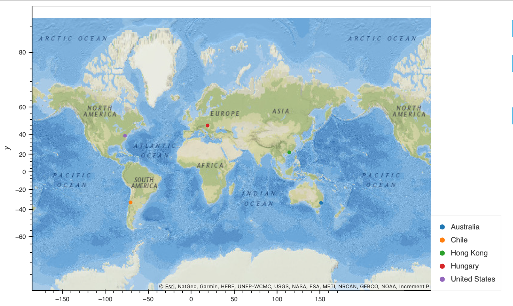
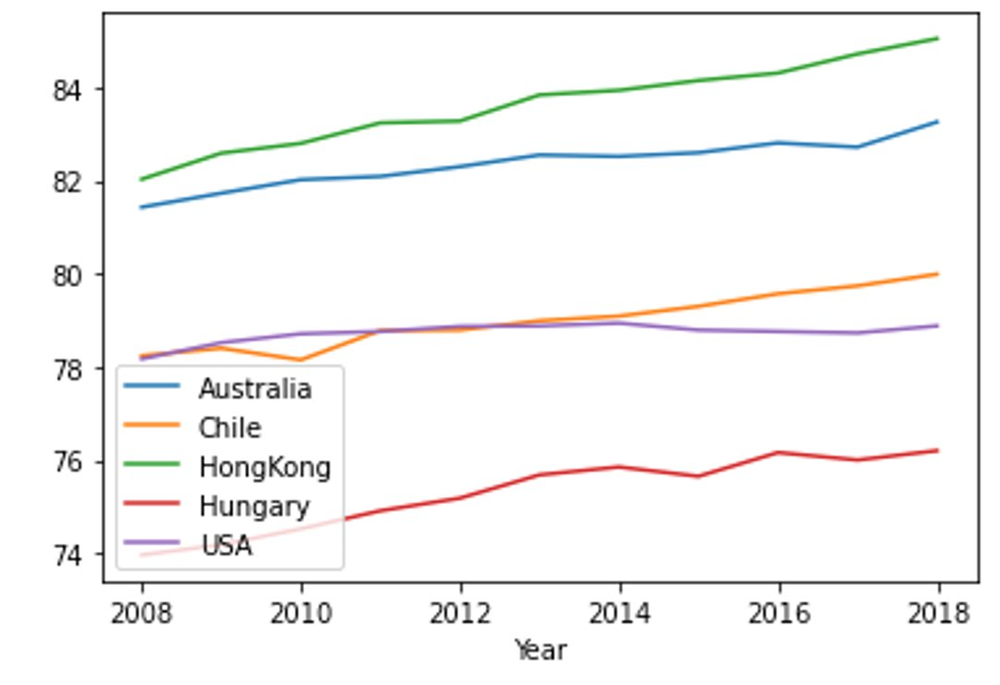
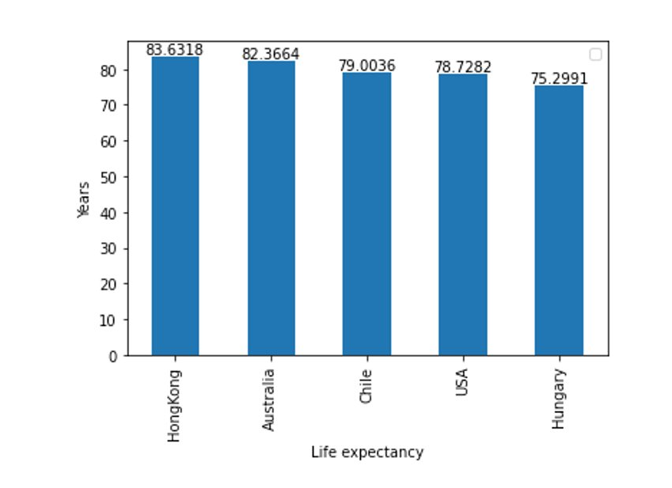
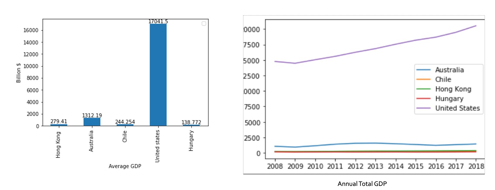
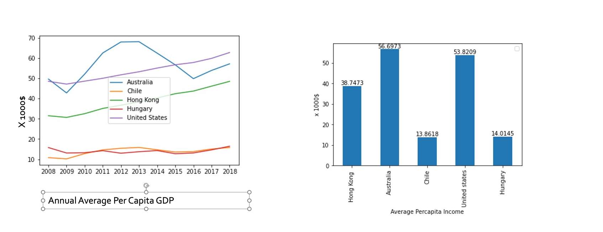
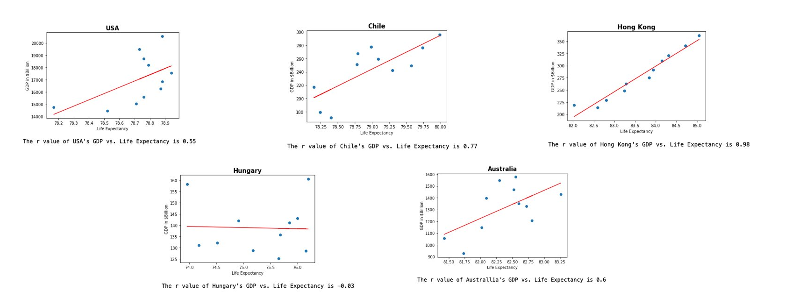
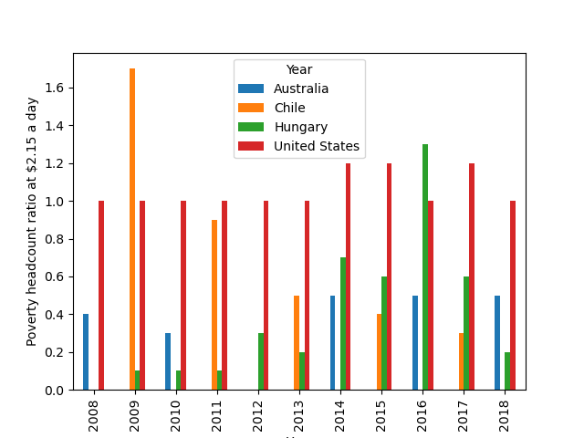

# Project-1_Topic_Global_Life_Expectancy

## Background

For this project, we are playing the part of data researchers for a Non- Profit Health Organization , investigating the possibility of a correlation between the economic output of a country and the life expectancy of its population. ​

During this project, we have sourced, prepared, analyzed and plotted data to try to answer the questions in a meaningful way.

We used data from 5 countries:​

* Australia​

* Chile​

* Hong Kong​

* Hungary​

* United States

## Our questions

1. What is the average life expectancy in these nations?​

2. Is Life expectancy different for men and women?​

3. Is there a correlation between the economy and life expectancy of a country?

Null Hypothesis: Life expectancy does not   depend on   which country one lives in.​

Alternate Hypothesis: Life expectancy is   different in   each country.

### Comparing life expectancy among these countries

### Looking at average value for these years

### Comparing the GDPs, over the 10 years and the average​

### Comparing the Per-capita income, over the 10 years and the average​

### Life Expectancy​ - Men vs. Women

.png)

### Linear Regression Models of Country Life Expectancy vs. GDP

### Poverty Data

## Conclusions:

* Looking at life expectancy by gender it's clear that women enjoy an overall longer life expectancy across all these countries.

* While we found that life expectancy in one country was directly proportional to its GDP, life expectancy across countries was not dependent on their respective GDPs when compared with each other

* Based on our research a country's economic indicators are not the best determinant of life expectancy. Further research could look into health policy or cultural factors that affect life expectancy outcomes in these countries.

## References​:

* https://www.britannica.com/science/life-expectancy​

* https://databank.worldbank.org/​

* https://www.mortality.org/

